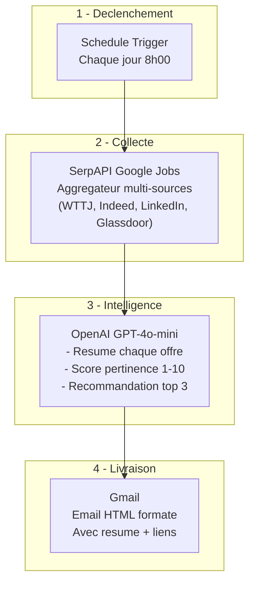

# PRD - Veille Automatique Offres Alternance "Product Builder No-Code & IA"

## 1. Vision & Objectif

**Projet** : Workflow n8n de veille quotidienne automatisée des offres d'alternance.

**Probleme** : La recherche manuelle quotidienne d'offres d'alternance sur plusieurs plateformes est chronophage et risque de manquer des opportunites recentes.

**Solution** : Un workflow n8n qui chaque matin a 8h00 :
1. Interroge SerpAPI Google Jobs (aggregateur multi-sources : WTTJ, Indeed, LinkedIn, Glassdoor)
2. Genere un resume intelligent via OpenAI (scoring de pertinence)
3. Envoie un email HTML formate sur Gmail

**Contraintes** :
- Workflow minimal : **4 nodes** uniquement, aucun node superflu
- Execution quotidienne automatique a 8h00 (Europe/Paris)
- Offres de moins de 7 jours uniquement
- Perimetre geographique : Paris et nord-ouest parisien (rayon 30km)

---

## 2. Utilisateur Cible

| Champ | Valeur |
|-------|--------|
| Profil | Candidat en recherche d'alternance |
| Poste vise | Product Builder No-Code & IA Generative |
| Localisation | Paris Nord-Ouest (92, 95, Paris) |
| Type contrat | Alternance (apprentissage + professionnalisation) |
| Email | Gmail (OAuth2) |

---

## 3. Source de Donnees

### 3.1 SerpAPI - Google Jobs (source unique / aggregateur)

| Champ | Detail |
|-------|--------|
| API | Google Jobs Engine |
| Base URL | `https://serpapi.com/search.json` |
| Auth | API Key (query parameter) |
| Inscription | [serpapi.com](https://serpapi.com) |
| Cout | Gratuit (100 recherches/mois) puis payant |
| Fiabilite | Haute |

> **Note** : SerpAPI agregge les resultats de Google Jobs qui indexe de nombreuses sources dont **Welcome to the Jungle**, Indeed, LinkedIn, Glassdoor, France Travail, etc. Une seule source suffit pour couvrir l'ensemble du marche.

**Parametres de recherche** :
```
engine=google_jobs
q=alternance product builder no-code IA generative
location=Paris, Ile-de-France, France
chips=date_posted:week
hl=fr
gl=fr
```

---

## 4. Architecture du Workflow

### 4.1 Diagramme du Workflow


### 4.2 Flux de donnees simplifie



---

## 5. Specifications Techniques par Node

### Node 1 : Schedule Trigger

| Propriete | Valeur |
|-----------|--------|
| Type | `n8n-nodes-base.scheduleTrigger` |
| typeVersion | `1.3` |
| Nom | `Declencheur 8h00` |
| Intervalle | Chaque jour |
| Heure | 8h00 |
| Timezone | Europe/Paris |

```json
{
  "parameters": {
    "rule": {
      "interval": [
        {
          "field": "hours",
          "triggerAtHour": 8
        }
      ]
    }
  },
  "name": "Declencheur 8h00",
  "type": "n8n-nodes-base.scheduleTrigger",
  "typeVersion": 1.3,
  "position": [0, 0]
}
```

### Node 2 : HTTP Request - SerpAPI Google Jobs

| Propriete | Valeur |
|-----------|--------|
| Type | `n8n-nodes-base.httpRequest` |
| typeVersion | `4.2` |
| Nom | `SerpAPI Google Jobs` |
| Methode | GET |
| Auth | Aucune (API Key en query param) |

**URL** :
```
https://serpapi.com/search.json?engine=google_jobs&q=alternance+product+builder+no-code+IA+generative&location=Paris,+Ile-de-France,+France&chips=date_posted:week&hl=fr&gl=fr&api_key={{ $env.SERPAPI_KEY }}
```

### Node 3 : OpenAI - Resume & Scoring

| Propriete | Valeur |
|-----------|--------|
| Type | `n8n-nodes-base.openAi` |
| typeVersion | `1.1` |
| Nom | `Resume IA` |
| Resource | Chat |
| Operation | Complete |
| Model | `gpt-4o-mini` |
| Max Tokens | `2000` |

**System Prompt** :
```
Tu es un assistant specialise dans la recherche d'alternance en Product Building no-code et IA generative.
Tu recois une liste d'offres d'emploi au format JSON brut de l'API Google Jobs (SerpAPI).
Tu dois :
1. Evaluer la pertinence de chaque offre (score de 1 a 10) par rapport au profil "Product Builder no-code & IA generative"
2. Generer un resume court (2-3 lignes) pour chaque offre
3. Identifier le TOP 3 des offres les plus pertinentes
4. Formater ta reponse en HTML propre pour un email

Chaque offre dans le JSON contient : title, company_name, location, description, detected_extensions.posted_at, detected_extensions.salary, apply_options[].link, via.

Format de sortie HTML :
<h2>Veille Emploi - {date}</h2>
<p><strong>{nombre} offres trouvees</strong></p>

<h3>TOP 3 Recommandations</h3>
(pour chaque offre du top 3 : titre, entreprise, score, resume, lien)

<h3>Toutes les offres</h3>
(tableau HTML avec : Score, Titre, Entreprise, Lieu, Resume, Lien)

Utilise un style professionnel et concis. Les scores doivent etre justifies en 1 phrase.
```

**User Prompt** :
```
Voici les offres d'alternance trouvees aujourd'hui via Google Jobs :

{{ JSON.stringify($json.jobs_results || [], null, 2) }}

Analyse et resume ces offres pour un profil "Product Builder no-code & IA generative" cherchant une alternance a Paris Nord-Ouest.
```

### Node 4 : Gmail - Envoi Email

| Propriete | Valeur |
|-----------|--------|
| Type | `n8n-nodes-base.gmail` |
| typeVersion | `2.2` |
| Nom | `Envoi Email` |
| Resource | Message |
| Operation | Send |
| Auth | OAuth2 (recommande) |

**Configuration** :
```json
{
  "parameters": {
    "sendTo": "{{ $env.EMAIL_DESTINATAIRE }}",
    "subject": "=Veille Alternance - {{ $now.toFormat('dd/MM/yyyy') }}",
    "emailType": "html",
    "message": "={{ $json.message?.content || $json.choices?.[0]?.message?.content || $json.text }}",
    "options": {
      "appendAttribution": false
    }
  },
  "name": "Envoi Email",
  "type": "n8n-nodes-base.gmail",
  "typeVersion": 2.2
}
```

---

## 6. Bonnes Pratiques n8n Appliquees

### 6.1 Nommage des Nodes
- Chaque node a un nom **descriptif et court** en francais
- Convention : `[Action] [Contexte]` (ex: "SerpAPI Google Jobs", "Resume IA")

### 6.2 Gestion des erreurs
- **Activer `continueOnFail`** sur le node HTTP Request SerpAPI : si l'API est down, le workflow ne plante pas
- **Workflow-level** : configurer un Error Workflow qui envoie une alerte email en cas d'echec

### 6.3 Variables d'environnement
Ne **jamais** hardcoder de credentials. Utiliser les variables d'environnement n8n :

| Variable | Description |
|----------|-------------|
| `SERPAPI_KEY` | Cle API SerpAPI |
| `EMAIL_DESTINATAIRE` | Adresse email de reception |

> **Note** : La fonctionnalite "Variables" dans l'UI n8n est reservee aux plans Enterprise/Cloud. Sur une instance community self-hosted, configurer les variables au niveau serveur (`docker-compose.yml`, `.env`, ou variables systeme).

```env
SERPAPI_KEY=votre_serpapi_key
EMAIL_DESTINATAIRE=vous@gmail.com
```

### 6.4 Performance
- **Pas de boucle** : toutes les offres traitees en batch dans un seul passage
- **Limiter les tokens OpenAI** : utiliser `gpt-4o-mini` (rapide et economique)
- **Description tronquee** a 500 caracteres pour reduire le payload envoye a OpenAI

### 6.5 Minimalisme
- **4 nodes uniquement** : pas de Code node intermediaire, OpenAI traite directement le JSON SerpAPI brut
- **Pas de IF/Switch** : logique lineaire simple
- **Workflow lineaire** : aucune branche parallele, chaque node s'enchaine sequentiellement

### 6.6 Versioning des Nodes
- Toujours utiliser les **typeVersions compatibles avec l'instance n8n en production** (actuellement n8n 1.83.2) :
  - Schedule Trigger : `1.3`
  - HTTP Request : `4.2`
  - OpenAI : `1.1`
  - Gmail : `2.2`
- **Attention** : le registre du MCP n8n peut indiquer des versions plus recentes (ex: `4.4`) que celles reellement supportees par l'instance. Utiliser une version non supportee provoque l'erreur `"Install this node to use it"` dans l'UI n8n. En cas de doute, verifier les templates officiels sur n8n.io ou la liste des nodes de l'instance.

### 6.7 Timezone
- Definir explicitement **Europe/Paris** dans le Schedule Trigger
- Utiliser `$now` (Luxon) pour les calculs de date : toujours timezone-aware

---

## 7. Plan d'Implementation par Etapes

### Phase 1 : Configuration de l'environnement

**Actions** :
1. S'inscrire sur [serpapi.com](https://serpapi.com) et recuperer l'API Key
2. Configurer les variables d'environnement (`SERPAPI_KEY`, `EMAIL_DESTINATAIRE`)
3. Configurer le credential Gmail OAuth2 dans n8n
4. Configurer le credential OpenAI API Key dans n8n

**Validation manuelle Phase 1** :
- [ ] Credential Gmail OAuth2 cree et teste (bouton "Test" dans n8n)
- [ ] Credential OpenAI API Key configure
- [ ] Cle SerpAPI fonctionnelle (tester dans un navigateur : `https://serpapi.com/search.json?engine=google_jobs&q=test&api_key=VOTRE_CLE`)

---

### Phase 2 : Schedule Trigger

**Actions** :
1. Creer un nouveau workflow dans n8n
2. Ajouter le node `Schedule Trigger`
3. Configurer : chaque jour a 8h00, timezone Europe/Paris
4. Ajouter un node `Manual Trigger` a cote (pour les tests - le retirer en production)

**Validation manuelle Phase 2** :
- [ ] Le node Schedule Trigger est configure sur 8h00 Europe/Paris
- [ ] Execution manuelle du trigger fonctionne (bouton "Execute")
- [ ] Le timestamp de sortie est correct (verifier dans l'onglet Output du node)

---

### Phase 3 : Integration SerpAPI Google Jobs

**Actions** :
1. Ajouter le node `HTTP Request` apres le trigger
2. Configurer l'URL SerpAPI avec les parametres
3. Tester l'appel API

**Validation manuelle Phase 3** :
- [ ] L'API SerpAPI retourne des resultats (verifier `jobs_results` dans l'output JSON)
- [ ] Les offres sont pertinentes (alternance, Paris, mots-cles corrects)
- [ ] Le filtre "derniere semaine" fonctionne (`chips=date_posted:week`)
- [ ] Le quota SerpAPI n'est pas depasse (verifier le dashboard SerpAPI)

---

### Phase 4 : OpenAI - Resume Intelligent

**Actions** :
1. Ajouter le node `OpenAI` apres SerpAPI Google Jobs
2. Configurer le credential OpenAI API Key
3. Configurer le system prompt et le user prompt
4. Tester la generation de resume

**Validation manuelle Phase 4** :
- [ ] L'API OpenAI repond correctement
- [ ] Le resume est en HTML valide
- [ ] Le scoring de pertinence (1-10) est present et coherent
- [ ] Le TOP 3 est identifie
- [ ] Le HTML est lisible et bien formate
- [ ] Le cout par execution est acceptable (verifier le dashboard OpenAI)

---

### Phase 5 : Gmail - Envoi du Resume

**Actions** :
1. Ajouter le node `Gmail` apres OpenAI
2. Configurer l'envoi avec le credential Gmail OAuth2
3. Tester l'envoi d'un email

**Validation manuelle Phase 5** :
- [ ] L'email est bien recu a l'adresse configuree
- [ ] Le sujet contient la date et le nombre d'offres
- [ ] Le contenu HTML est correctement rendu (pas de code brut)
- [ ] Les liens vers les offres sont cliquables
- [ ] Le mail n'arrive pas en spam

---

### Phase 6 : Test End-to-End et Mise en Production

**Actions** :
1. Executer le workflow complet manuellement
2. Verifier le mail recu
3. Activer le workflow (toggle "Active")
4. Configurer un Error Workflow (optionnel mais recommande)
5. Retirer le node Manual Trigger

**Validation manuelle Phase 6** :
- [ ] Execution complete sans erreur (verifier Executions dans n8n)
- [ ] Email recu avec contenu pertinent
- [ ] Le workflow est actif (toggle vert)
- [ ] Le lendemain a 8h00, le workflow s'execute automatiquement
- [ ] Verifier les logs d'execution apres la premiere execution automatique
- [ ] Optionnel : Error Workflow configure et teste

---

## 8. Gestion des Cas Limites

| Scenario | Comportement attendu |
|----------|---------------------|
| SerpAPI down | `continueOnFail=true` : le workflow continue, OpenAI recoit un JSON vide |
| 0 offre trouvee | `jobs_results` vide, OpenAI genere un message "Aucune offre trouvee" |
| Trop d'offres (>50) | OpenAI resume les plus pertinentes dans la limite de tokens |
| Erreur OpenAI | Le workflow echoue — configurer un Error Workflow pour alerter |
| Quota SerpAPI epuise | Le node echoue silencieusement (`continueOnFail`), email envoye sans offres |

---

## 9. Cout Estimatif Mensuel

| Service | Cout |
|---------|------|
| SerpAPI | Gratuit (100 req/mois) = ~3.3 req/jour = OK pour 1 req/jour |
| OpenAI (gpt-4o-mini) | ~0.01-0.05 EUR/jour = ~0.30-1.50 EUR/mois |
| Gmail | Gratuit |
| n8n (self-hosted) | Gratuit |
| **Total** | **< 2 EUR/mois** |

---

## 10. Evolutions Futures (hors scope)

- Ajouter un stockage Airtable pour historiser les offres et eviter les re-notifications
- Ajouter un filtre par salaire minimum
- Envoyer sur Slack/Telegram en complement du mail
- Ajouter un lien "Postuler en 1 clic" via un webhook
- Dashboard Airtable avec suivi des candidatures
