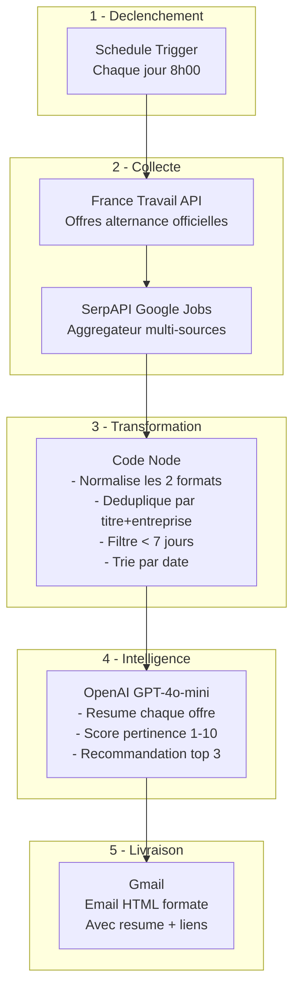

# PRD - Veille Automatique Offres Alternance "Product Builder No-Code & IA"

## 1. Vision & Objectif

**Projet** : Workflow n8n de veille quotidienne automatisée des offres d'alternance.

**Probleme** : La recherche manuelle quotidienne d'offres d'alternance sur plusieurs plateformes est chronophage et risque de manquer des opportunites recentes.

**Solution** : Un workflow n8n qui chaque matin a 8h00 :
1. Interroge automatiquement 2 sources d'emploi (France Travail API + SerpAPI Google Jobs)
2. Fusionne et deduplique les resultats
3. Genere un resume intelligent via OpenAI (scoring de pertinence)
4. Envoie un email HTML formate sur Gmail

**Contraintes** :
- Workflow minimal : **6 nodes** uniquement, aucun node superflu
- Execution quotidienne automatique a 8h00 (Europe/Paris)
- Offres de moins de 7 jours uniquement
- Perimetre geographique : Paris et nord-ouest parisien (rayon 30km)

---

## 2. Utilisateur Cible

| Champ | Valeur |
|-------|--------|
| Profil | Candidat en recherche d'alternance |
| Poste vise | Product Builder No-Code & IA Generative |
| Localisation | Paris Nord-Ouest (92, 95, Paris) |
| Type contrat | Alternance (apprentissage + professionnalisation) |
| Email | Gmail (OAuth2) |

---

## 3. Sources de Donnees

### 3.1 France Travail API (source principale)

| Champ | Detail |
|-------|--------|
| API | Offres d'emploi v2 |
| Base URL | `https://api.francetravail.io/partenaire/offresdemploi/v2/offres/search` |
| Auth | OAuth2 Client Credentials |
| Token URL | `https://entreprise.francetravail.fr/connexion/oauth2/access_token?realm=/partenaire` |
| Scope | `api_offresdemploiv2 o2dsoffre` |
| Inscription | [francetravail.io/data/api](https://francetravail.io/data/api) |
| Cout | Gratuit |
| Fiabilite | Haute (API officielle gouvernementale) |

**Parametres de recherche** :
```
motsCles=product builder,no-code,no code,IA generative,intelligence artificielle
typeContrat=E2,FS          # E2=Apprentissage, FS=Professionnalisation
commune=75056              # Paris (code INSEE)
distance=30                # 30km autour de Paris
minCreationDate=YYYY-MM-DD # Date = aujourd'hui - 7 jours
range=0-149                # Max 150 resultats
```

### 3.2 SerpAPI - Google Jobs (source secondaire / aggregateur)

| Champ | Detail |
|-------|--------|
| API | Google Jobs Engine |
| Base URL | `https://serpapi.com/search.json` |
| Auth | API Key (query parameter) |
| Inscription | [serpapi.com](https://serpapi.com) |
| Cout | Gratuit (100 recherches/mois) puis payant |
| Fiabilite | Haute |

> **Note** : SerpAPI agregge les resultats de Google Jobs qui indexe de nombreuses sources dont **Welcome to the Jungle**, Indeed, LinkedIn, Glassdoor, etc. Cela couvre le besoin WTTJ sans necessiter un node supplementaire.

**Parametres de recherche** :
```
engine=google_jobs
q=alternance product builder no-code IA generative
location=Paris, Ile-de-France, France
chips=date_posted:week
hl=fr
gl=fr
```

---

## 4. Architecture du Workflow

### 4.1 Diagramme du Workflow


### 4.2 Flux de donnees simplifie



---

## 5. Specifications Techniques par Node

### Node 1 : Schedule Trigger

| Propriete | Valeur |
|-----------|--------|
| Type | `n8n-nodes-base.scheduleTrigger` |
| typeVersion | `1.3` |
| Nom | `Declencheur 8h00` |
| Intervalle | Chaque jour |
| Heure | 8h00 |
| Timezone | Europe/Paris |

```json
{
  "parameters": {
    "rule": {
      "interval": [
        {
          "field": "hours",
          "triggerAtHour": 8
        }
      ]
    }
  },
  "name": "Declencheur 8h00",
  "type": "n8n-nodes-base.scheduleTrigger",
  "typeVersion": 1.3,
  "position": [0, 0]
}
```

### Node 2 : HTTP Request - France Travail API

| Propriete | Valeur |
|-----------|--------|
| Type | `n8n-nodes-base.httpRequest` |
| typeVersion | `4.4` |
| Nom | `France Travail API` |
| Methode | GET |
| Auth | OAuth2 (Client Credentials) |

**Pre-requis** : Creer un credential n8n de type "OAuth2 API" avec :
- Token URL : `https://entreprise.francetravail.fr/connexion/oauth2/access_token?realm=/partenaire`
- Grant Type : Client Credentials
- Client ID : `{{ $env.FRANCE_TRAVAIL_CLIENT_ID }}`
- Client Secret : `{{ $env.FRANCE_TRAVAIL_CLIENT_SECRET }}`
- Scope : `api_offresdemploiv2 o2dsoffre`

**URL avec parametres dynamiques** :
```
https://api.francetravail.io/partenaire/offresdemploi/v2/offres/search?motsCles=product%20builder,no-code,no%20code,IA%20generative&typeContrat=E2,FS&commune=75056&distance=30&minCreationDate={{ $now.minus({days: 7}).toFormat('yyyy-MM-dd') + 'T00:00:00Z' }}&range=0-149
```

### Node 3 : HTTP Request - SerpAPI Google Jobs

| Propriete | Valeur |
|-----------|--------|
| Type | `n8n-nodes-base.httpRequest` |
| typeVersion | `4.4` |
| Nom | `SerpAPI Google Jobs` |
| Methode | GET |
| Auth | Aucune (API Key en query param) |

**URL** :
```
https://serpapi.com/search.json?engine=google_jobs&q=alternance+product+builder+no-code+IA+generative&location=Paris,+Ile-de-France,+France&chips=date_posted:week&hl=fr&gl=fr&api_key={{ $env.SERPAPI_KEY }}
```

### Node 4 : Code - Merge & Dedup & Format

| Propriete | Valeur |
|-----------|--------|
| Type | `n8n-nodes-base.code` |
| typeVersion | `2` |
| Nom | `Merge Dedup Format` |
| Mode | Run Once for All Items |

**Code JavaScript** :
```javascript
// Recuperer les donnees des 2 sources
const franceTravailData = $('France Travail API').first().json;
const serpApiData = $('SerpAPI Google Jobs').first().json;

const offers = [];
const seenKeys = new Set();

// 1. Parser les offres France Travail
const ftOffres = franceTravailData.resultats || [];
for (const offre of ftOffres) {
  const key = (offre.intitule + '|' + (offre.entreprise?.nom || '')).toLowerCase();
  if (!seenKeys.has(key)) {
    seenKeys.add(key);
    offers.push({
      source: 'France Travail',
      titre: offre.intitule || '',
      entreprise: offre.entreprise?.nom || 'Non precisee',
      lieu: offre.lieuTravail?.libelle || '',
      datePublication: offre.dateCreation || '',
      typeContrat: offre.typeContrat || '',
      description: (offre.description || '').substring(0, 500),
      url: offre.origineOffre?.urlOrigine || `https://candidat.francetravail.fr/offres/recherche/detail/${offre.id}`,
      salaire: offre.salaire?.libelle || 'Non precise'
    });
  }
}

// 2. Parser les offres SerpAPI Google Jobs
const serpJobs = serpApiData.jobs_results || [];
for (const job of serpJobs) {
  const key = (job.title + '|' + (job.company_name || '')).toLowerCase();
  if (!seenKeys.has(key)) {
    seenKeys.add(key);
    offers.push({
      source: 'Google Jobs' + (job.via ? ` (${job.via})` : ''),
      titre: job.title || '',
      entreprise: job.company_name || 'Non precisee',
      lieu: job.location || '',
      datePublication: job.detected_extensions?.posted_at || '',
      typeContrat: 'Alternance',
      description: (job.description || '').substring(0, 500),
      url: job.apply_options?.[0]?.link || job.share_link || '',
      salaire: job.detected_extensions?.salary || 'Non precise'
    });
  }
}

// 3. Trier par date (plus recentes en premier)
offers.sort((a, b) => {
  const dateA = new Date(a.datePublication || 0);
  const dateB = new Date(b.datePublication || 0);
  return dateB - dateA;
});

// 4. Retourner un seul item avec toutes les offres
return [{
  json: {
    totalOffres: offers.length,
    dateRecherche: new Date().toISOString().split('T')[0],
    offres: offers
  }
}];
```

### Node 5 : OpenAI - Resume & Scoring

| Propriete | Valeur |
|-----------|--------|
| Type | `n8n-nodes-base.openAi` |
| typeVersion | `1.1` |
| Nom | `Resume IA` |
| Resource | Chat |
| Operation | Complete |
| Model | `gpt-4o-mini` |
| Max Tokens | `2000` |

**System Prompt** :
```
Tu es un assistant specialise dans la recherche d'alternance en Product Building no-code et IA generative.
Tu recois une liste d'offres d'emploi et tu dois :
1. Evaluer la pertinence de chaque offre (score de 1 a 10) par rapport au profil "Product Builder no-code & IA generative"
2. Generer un resume court (2-3 lignes) pour chaque offre
3. Identifier le TOP 3 des offres les plus pertinentes
4. Formater ta reponse en HTML propre pour un email

Format de sortie HTML :
<h2>Veille Emploi - {date}</h2>
<p><strong>{nombre} offres trouvees</strong></p>

<h3>TOP 3 Recommandations</h3>
(pour chaque offre du top 3 : titre, entreprise, score, resume, lien)

<h3>Toutes les offres</h3>
(tableau HTML avec : Score, Titre, Entreprise, Lieu, Resume, Lien)

Utilise un style professionnel et concis. Les scores doivent etre justifies en 1 phrase.
```

**User Prompt** :
```
Voici les {{ $json.totalOffres }} offres trouvees le {{ $json.dateRecherche }} :

{{ JSON.stringify($json.offres, null, 2) }}

Analyse et resume ces offres pour un profil "Product Builder no-code & IA generative" cherchant une alternance a Paris Nord-Ouest.
```

### Node 6 : Gmail - Envoi Email

| Propriete | Valeur |
|-----------|--------|
| Type | `n8n-nodes-base.gmail` |
| typeVersion | `2.2` |
| Nom | `Envoi Email` |
| Resource | Message |
| Operation | Send |
| Auth | OAuth2 (recommande) |

**Configuration** :
```json
{
  "parameters": {
    "sendTo": "{{ $env.EMAIL_DESTINATAIRE }}",
    "subject": "=Veille Alternance - {{ $now.toFormat('dd/MM/yyyy') }} - {{ $('Merge Dedup Format').first().json.totalOffres }} offres",
    "emailType": "html",
    "message": "={{ $json.message?.content || $json.choices?.[0]?.message?.content || $json.text }}",
    "options": {
      "appendAttribution": false
    }
  },
  "name": "Envoi Email",
  "type": "n8n-nodes-base.gmail",
  "typeVersion": 2.2
}
```

---

## 6. Bonnes Pratiques n8n Appliquees

### 6.1 Nommage des Nodes
- Chaque node a un nom **descriptif et court** en francais
- Convention : `[Action] [Contexte]` (ex: "France Travail API", "Merge Dedup Format")

### 6.2 Gestion des erreurs
- **Activer `continueOnFail`** sur les 2 nodes HTTP Request : si une API est down, l'autre source continue
- **Node Code** : try/catch avec fallback si une source retourne 0 resultats
- **Workflow-level** : configurer un Error Workflow qui envoie une alerte email en cas d'echec

### 6.3 Variables d'environnement
Ne **jamais** hardcoder de credentials. Utiliser les variables d'environnement n8n :

| Variable | Description |
|----------|-------------|
| `FRANCE_TRAVAIL_CLIENT_ID` | Client ID France Travail API |
| `FRANCE_TRAVAIL_CLIENT_SECRET` | Client Secret France Travail API |
| `SERPAPI_KEY` | Cle API SerpAPI |
| `EMAIL_DESTINATAIRE` | Adresse email de reception |

Configuration dans `docker-compose.yml` ou `.env` :
```env
FRANCE_TRAVAIL_CLIENT_ID=votre_client_id
FRANCE_TRAVAIL_CLIENT_SECRET=votre_client_secret
SERPAPI_KEY=votre_serpapi_key
EMAIL_DESTINATAIRE=vous@gmail.com
```

### 6.4 Performance
- **Pas de boucle** : toutes les offres traitees en batch dans un seul passage
- **Limiter les tokens OpenAI** : utiliser `gpt-4o-mini` (rapide et economique)
- **Description tronquee** a 500 caracteres pour reduire le payload envoye a OpenAI

### 6.5 Minimalisme
- **6 nodes uniquement** : pas de node Merge (on utilise `$('NodeName')` dans le Code node)
- **Pas de IF/Switch** : le Code node gere toute la logique de transformation
- **Workflow lineaire** : aucune branche parallele, chaque node s'enchaine sequentiellement

### 6.6 Versioning des Nodes
- Toujours utiliser la **derniere typeVersion stable** de chaque node :
  - Schedule Trigger : `1.3`
  - HTTP Request : `4.4`
  - Code : `2`
  - OpenAI : `1.1`
  - Gmail : `2.2`

### 6.7 Timezone
- Definir explicitement **Europe/Paris** dans le Schedule Trigger
- Utiliser `$now` (Luxon) pour les calculs de date : toujours timezone-aware

---

## 7. Plan d'Implementation par Etapes

### Phase 1 : Configuration de l'environnement

**Actions** :
1. S'inscrire sur [francetravail.io/data/api](https://francetravail.io/data/api) et creer une application
2. Recuperer Client ID + Client Secret pour l'API "Offres d'emploi v2"
3. S'inscrire sur [serpapi.com](https://serpapi.com) et recuperer l'API Key
4. Configurer les variables d'environnement dans n8n
5. Configurer le credential Gmail OAuth2 dans n8n

**Validation manuelle Phase 1** :
- [ ] Variables d'environnement accessibles dans n8n (`Settings > Variables`)
- [ ] Credential Gmail OAuth2 cree et teste (bouton "Test" dans n8n)
- [ ] Credential France Travail OAuth2 cree
- [ ] Cle SerpAPI fonctionnelle (tester dans un navigateur : `https://serpapi.com/search.json?engine=google_jobs&q=test&api_key=VOTRE_CLE`)

---

### Phase 2 : Schedule Trigger

**Actions** :
1. Creer un nouveau workflow dans n8n
2. Ajouter le node `Schedule Trigger`
3. Configurer : chaque jour a 8h00, timezone Europe/Paris
4. Ajouter un node `Manual Trigger` a cote (pour les tests - le retirer en production)

**Validation manuelle Phase 2** :
- [ ] Le node Schedule Trigger est configure sur 8h00 Europe/Paris
- [ ] Execution manuelle du trigger fonctionne (bouton "Execute")
- [ ] Le timestamp de sortie est correct (verifier dans l'onglet Output du node)

---

### Phase 3 : Integration France Travail API

**Actions** :
1. Ajouter le node `HTTP Request` apres le trigger
2. Configurer l'authentification OAuth2
3. Configurer l'URL avec les parametres de recherche
4. Tester l'appel API

**Validation manuelle Phase 3** :
- [ ] L'authentification OAuth2 fonctionne (token obtenu)
- [ ] L'API retourne des resultats (verifier `resultats` dans l'output JSON)
- [ ] Les offres retournees sont bien des alternances
- [ ] Les offres sont bien situees autour de Paris
- [ ] La date minimum est respectee (< 7 jours)
- [ ] En cas de 0 resultat, le node ne plante pas (tester avec un mot-cle rare)

---

### Phase 4 : Integration SerpAPI Google Jobs

**Actions** :
1. Ajouter le node `HTTP Request` apres France Travail
2. Configurer l'URL SerpAPI avec les parametres
3. Tester l'appel API

**Validation manuelle Phase 4** :
- [ ] L'API SerpAPI retourne des resultats (verifier `jobs_results` dans l'output JSON)
- [ ] Les offres sont pertinentes (alternance, Paris, mots-cles corrects)
- [ ] Le filtre "derniere semaine" fonctionne (`chips=date_posted:week`)
- [ ] Le quota SerpAPI n'est pas depasse (verifier le dashboard SerpAPI)

---

### Phase 5 : Code Node - Fusion et Formatage

**Actions** :
1. Ajouter le node `Code` apres SerpAPI
2. Coller le code JavaScript de la section 5.4
3. Tester avec les donnees reelles des 2 sources

**Validation manuelle Phase 5** :
- [ ] Le code accede bien aux 2 sources via `$('France Travail API')` et `$('SerpAPI Google Jobs')`
- [ ] Les offres sont correctement normalisees (memes champs pour les 2 sources)
- [ ] La deduplication fonctionne (pas de doublons titre+entreprise)
- [ ] Le tri par date fonctionne (offres recentes en premier)
- [ ] Le champ `totalOffres` est correct
- [ ] En cas de 0 offre, le workflow continue sans erreur

---

### Phase 6 : OpenAI - Resume Intelligent

**Actions** :
1. Ajouter le node `OpenAI` apres le Code node
2. Configurer le credential OpenAI API Key
3. Configurer le system prompt et le user prompt
4. Tester la generation de resume

**Validation manuelle Phase 6** :
- [ ] L'API OpenAI repond correctement
- [ ] Le resume est en HTML valide
- [ ] Le scoring de pertinence (1-10) est present et coherent
- [ ] Le TOP 3 est identifie
- [ ] Le HTML est lisible et bien formate
- [ ] Le cout par execution est acceptable (verifier le dashboard OpenAI)

---

### Phase 7 : Gmail - Envoi du Resume

**Actions** :
1. Ajouter le node `Gmail` apres OpenAI
2. Configurer l'envoi avec le credential Gmail OAuth2
3. Tester l'envoi d'un email

**Validation manuelle Phase 7** :
- [ ] L'email est bien recu a l'adresse configuree
- [ ] Le sujet contient la date et le nombre d'offres
- [ ] Le contenu HTML est correctement rendu (pas de code brut)
- [ ] Les liens vers les offres sont cliquables
- [ ] Le mail n'arrive pas en spam

---

### Phase 8 : Test End-to-End et Mise en Production

**Actions** :
1. Executer le workflow complet manuellement
2. Verifier le mail recu
3. Activer le workflow (toggle "Active")
4. Configurer un Error Workflow (optionnel mais recommande)
5. Retirer le node Manual Trigger

**Validation manuelle Phase 8** :
- [ ] Execution complete sans erreur (verifier Executions dans n8n)
- [ ] Email recu avec contenu pertinent
- [ ] Le workflow est actif (toggle vert)
- [ ] Le lendemain a 8h00, le workflow s'execute automatiquement
- [ ] Verifier les logs d'execution apres la premiere execution automatique
- [ ] Optionnel : Error Workflow configure et teste

---

## 8. Gestion des Cas Limites

| Scenario | Comportement attendu |
|----------|---------------------|
| France Travail API down | `continueOnFail=true` : le workflow continue avec SerpAPI seul |
| SerpAPI down | `continueOnFail=true` : le workflow continue avec France Travail seul |
| 0 offre trouvee | Le Code node retourne `totalOffres: 0`, OpenAI genere un message "Aucune offre" |
| Trop d'offres (>50) | Le Code node tronque les descriptions, OpenAI resume les top 20 |
| Erreur OpenAI | Email envoye avec la liste brute des offres (fallback dans le Code node) |
| Quota SerpAPI epuise | Le node echoue silencieusement, France Travail couvre le besoin |

---

## 9. Cout Estimatif Mensuel

| Service | Cout |
|---------|------|
| France Travail API | Gratuit |
| SerpAPI | Gratuit (100 req/mois) = ~3.3 req/jour = OK pour 1 req/jour |
| OpenAI (gpt-4o-mini) | ~0.01-0.05 EUR/jour = ~0.30-1.50 EUR/mois |
| Gmail | Gratuit |
| n8n (self-hosted) | Gratuit |
| **Total** | **< 2 EUR/mois** |

---

## 10. Evolutions Futures (hors scope)

- Ajouter un stockage Airtable pour historiser les offres et eviter les re-notifications
- Ajouter un filtre par salaire minimum
- Envoyer sur Slack/Telegram en complement du mail
- Ajouter un lien "Postuler en 1 clic" via un webhook
- Dashboard Airtable avec suivi des candidatures
