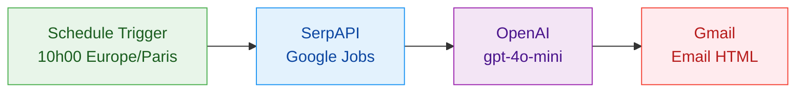

# Job Scraper - n8n Workflow

Workflow [n8n](https://n8n.io) qui automatise la veille quotidienne d'offres d'alternance **Product Builder No-Code & IA Generative** autour de Paris.

Chaque matin, le workflow collecte les offres via Google Jobs, les analyse avec OpenAI, et envoie un email HTML avec un scoring de pertinence et un TOP 3.

## Architecture



| Node | Role |
|------|------|
| **Schedule Trigger** | Declenchement quotidien a 10h00 (Europe/Paris) |
| **SerpAPI Google Jobs** | Recherche d'offres via l'API Google Jobs (alternance, no-code, IA) |
| **OpenAI (gpt-4o-mini)** | Scoring de pertinence 1-10, resume par offre, TOP 3, sortie HTML |
| **Gmail** | Envoi de l'email HTML formate |

## Prerequis

- Une instance **n8n** (self-hosted ou cloud)
- Un compte [SerpAPI](https://serpapi.com) (100 recherches gratuites/mois)
- Un compte [OpenAI](https://platform.openai.com) avec credits API
- Un compte Google avec [OAuth2 configure](https://console.cloud.google.com) pour Gmail

## Installation

### 1. Cloner le repo

```bash
git clone https://github.com/VOTRE-USERNAME/n8n-scraper.git
```

### 2. Configurer les credentials dans n8n

| Credential | Type | Configuration |
|-----------|------|---------------|
| SerpAPI | API Key en URL | Recuperer la cle sur [serpapi.com](https://serpapi.com) |
| OpenAI | OpenAI API Key | Recuperer la cle sur [platform.openai.com](https://platform.openai.com) |
| Gmail | Gmail OAuth2 | Client ID + Secret via [Google Cloud Console](https://console.cloud.google.com) |

### 3. Importer le workflow

Creer le workflow dans n8n en suivant la specification detaillee dans [`WORKFLOW-DOC.md`](WORKFLOW-DOC.md).

### 4. Variables d'environnement

Configurer dans l'environnement du serveur n8n :

```env
SERPAPI_KEY=votre_cle_serpapi
```

## Documentation

| Fichier | Contenu |
|---------|---------|
| [`PRD.md`](PRD.md) | Specification complete : prompts OpenAI, parametres API, phases d'implementation |
| [`WORKFLOW-DOC.md`](WORKFLOW-DOC.md) | Reference technique : diagrammes, structure de donnees, credentials, checklist |
| [`CLAUDE.md`](CLAUDE.md) | Instructions pour Claude Code (assistant IA) |

## Cout estimatif

| Service | Cout mensuel |
|---------|-------------|
| SerpAPI | Gratuit (1 req/jour sur 100/mois) |
| OpenAI (gpt-4o-mini) | ~0.30 - 1.50 EUR |
| Gmail | Gratuit |
| n8n (self-hosted) | Gratuit |
| **Total** | **< 2 EUR/mois** |

## Licence

MIT
