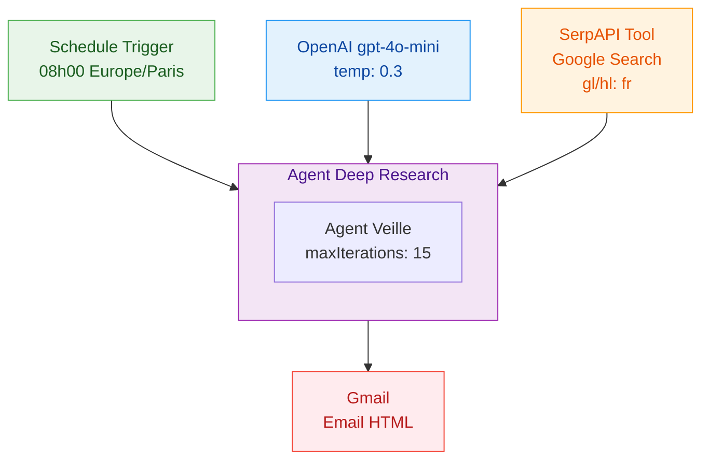

# Veille Alternance - Agent IA (n8n)

Workflow [n8n](https://n8n.io) qui automatise la veille quotidienne d'offres d'alternance **Product Builder No-Code & IA Generative** autour de Paris.

Chaque matin, un **Agent IA autonome** recherche les offres sur Google avec des mots-cles varies, analyse leur pertinence, et envoie un email HTML avec un scoring et un TOP 3.

## Architecture



| Node | Type n8n | Role |
|------|----------|------|
| **Declencheur 08h00** | `scheduleTrigger` | Declenchement quotidien a 08h00 (Europe/Paris) |
| **Agent Veille** | `langchain.agent` | Agent autonome : decide ses recherches, analyse les resultats, compose le HTML |
| **OpenAI Chat Model** | `langchain.lmChatOpenAi` | LLM gpt-4o-mini qui pilote l'agent (raisonnement, scoring, redaction) |
| **SerpAPI Tool** | `langchain.toolSerpApi` | Outil de recherche Google — l'agent lance plusieurs requetes avec des mots-cles varies |
| **Envoi Email** | `gmail` | Envoi de l'email HTML avec le rapport de veille |

## Prerequis

- Une instance **n8n** (self-hosted ou cloud)
- Un compte [SerpAPI](https://serpapi.com) (100 recherches gratuites/mois)
- Un compte [OpenAI](https://platform.openai.com) avec credits API
- Un compte Google avec [OAuth2 configure](https://console.cloud.google.com) pour Gmail

## Installation

### 1. Cloner le repo

```bash
git clone https://github.com/VOTRE-USERNAME/n8n-scraper.git
```

### 2. Configurer les credentials dans n8n

Dans n8n > **Settings** > **Credentials** > **Add Credential** :

| Credential | Type | Configuration |
|-----------|------|---------------|
| OpenAI | OpenAI API Key | Recuperer la cle sur [platform.openai.com](https://platform.openai.com) |
| SerpAPI | SerpApi API | Recuperer la cle sur [serpapi.com/manage-api-key](https://serpapi.com/manage-api-key) |
| Gmail | Gmail OAuth2 | Client ID + Secret via [Google Cloud Console](https://console.cloud.google.com) |

### 3. Deployer le workflow

Le workflow est gere via les outils MCP n8n. Voir [`WORKFLOW-DOC.md`](WORKFLOW-DOC.md) pour la configuration detaillee de chaque node.

### 4. Associer les credentials

Ouvrir le workflow dans l'UI n8n et associer chaque credential aux nodes correspondants :
- **OpenAI Chat Model** → OpenAI API
- **SerpAPI Tool** → SerpApi API
- **Envoi Email** → Gmail OAuth2

## Documentation

| Fichier | Contenu |
|---------|---------|
| [`WORKFLOW-DOC.md`](WORKFLOW-DOC.md) | Reference technique : diagrammes, config des nodes, connections, credentials |
| [`PRD.md`](PRD.md) | Specification originale (v1) : profil candidat, mots-cles, edge cases |
| [`architecture-deep-research.md`](architecture-deep-research.md) | Architecture v3.0 prevue : Deep Research avec lecture des pages web |
| [`CLAUDE.md`](CLAUDE.md) | Instructions pour Claude Code (assistant IA) |

## Cout estimatif

| Service | Cout mensuel |
|---------|-------------|
| SerpAPI | Gratuit (6-10 req/jour, ~200/mois — plan payant si > 100) |
| OpenAI (gpt-4o-mini) | ~$1-3 |
| Gmail | Gratuit |
| n8n (self-hosted) | Gratuit |
| **Total** | **~$1-3/mois** (ou ~$50 si SerpAPI payant) |

## Roadmap

- [x] v1.0 — Pipeline lineaire SerpAPI → OpenAI → Gmail
- [x] v2.0 — Agent IA autonome avec recherches adaptatives
- [ ] v3.0 — [Deep Research](architecture-deep-research.md) : lecture des pages web + Code Tool
- [ ] v4.0 — Airtable : historique des offres, deduplication, suivi des candidatures

