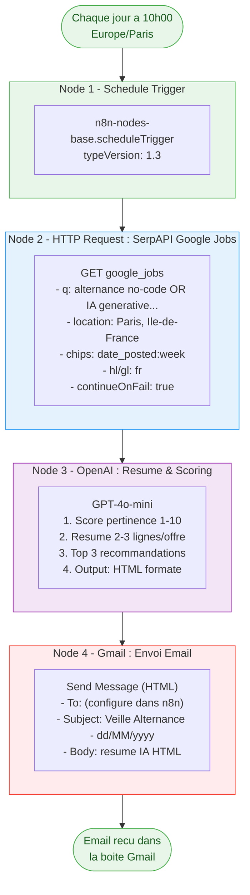
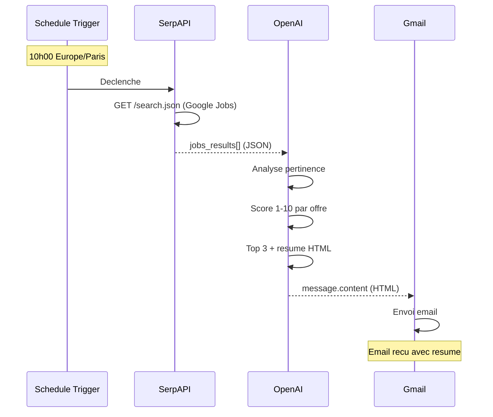

# Documentation Workflow - Veille Alternance n8n

## Vue d'ensemble

Workflow n8n automatise qui collecte, analyse et envoie chaque matin un resume des offres d'alternance "Product Builder No-Code & IA Generative" autour de Paris.

**4 nodes | Execution quotidienne 10h00 Europe/Paris | Workflow actif**

- **Workflow ID** : *(votre workflow ID)*
- **Instance** : *(votre URL n8n)*
- **Version** : 1.1

---

## Diagramme du Workflow



---

## Diagramme de sequence



---

## Detail des nodes

### Node 1 : Declencheur 10h00

| Propriete | Valeur |
|-----------|--------|
| ID | `node-1-trigger` |
| Type | `n8n-nodes-base.scheduleTrigger` |
| typeVersion | `1.3` |
| Declenchement | Chaque jour a 10h00 |
| Timezone | Europe/Paris (settings workflow) |

### Node 2 : SerpAPI Google Jobs

| Propriete | Valeur |
|-----------|--------|
| ID | `node-3-serpapi` |
| Type | `n8n-nodes-base.httpRequest` |
| typeVersion | `4.2` |
| Methode | GET |
| onError | `continueRegularOutput` |

**Requete SerpAPI** :
```
engine=google_jobs
q=alternance "no-code" OR "no code" OR "IA generative" OR "intelligence artificielle" Paris
location=Paris, Ile-de-France, France
chips=date_posted:week
hl=fr
gl=fr
```

> La requete utilise des operateurs OR pour elargir les resultats. `alternance` et `Paris` sont toujours presents, combines avec des variantes no-code / IA.

### Node 3 : Resume IA (OpenAI)

| Propriete | Valeur |
|-----------|--------|
| ID | `node-5-openai` |
| Type | `n8n-nodes-base.openAi` |
| typeVersion | `1.1` |
| Resource | Chat |
| Operation | Complete |
| Modele | `gpt-4o-mini` |
| Max Tokens | `2000` |
| Simplify Output | `true` |
| Credential | `OpenAi account` |

**System Prompt** : Analyse des offres, scoring 1-10, resume par offre, TOP 3, sortie HTML formatee.

**User Prompt** : Injecte `$json.jobs_results` (sortie SerpAPI) au format JSON.

**Sortie** : `$json.message.content` contient le HTML genere.

### Node 4 : Envoi Email (Gmail)

| Propriete | Valeur |
|-----------|--------|
| ID | `node-6-gmail` |
| Type | `n8n-nodes-base.gmail` |
| typeVersion | `2.2` |
| Resource | Message |
| Operation | Send |
| Credential | `Mam OAuth` (Gmail OAuth2) |

**Configuration** :
- **To** : *(configure dans n8n)*
- **Subject** : `Veille Alternance - {{ $now.toFormat('dd/MM/yyyy') }}`
- **Body** : `{{ $json.message.content }}`
- **appendAttribution** : `false`

---

## Structure des donnees

### Sortie SerpAPI (input pour OpenAI)

```json
{
  "jobs_results": [
    {
      "title": "Alternant Product Builder IA",
      "company_name": "TechCorp",
      "location": "Levallois-Perret",
      "description": "Rejoignez notre equipe produit...",
      "detected_extensions": {
        "posted_at": "Il y a 3 jours",
        "salary": "Non precise"
      },
      "apply_options": [
        {
          "title": "Postuler sur Welcome to the Jungle",
          "link": "https://www.welcometothejungle.com/..."
        }
      ],
      "via": "Welcome to the Jungle"
    }
  ],
  "jobs_results_state": "Results for exact spelling",
  "search_parameters": {
    "q": "alternance \"no-code\" OR \"no code\" OR \"IA generative\" OR \"intelligence artificielle\" Paris",
    "location_requested": "Paris, Ile-de-France, France"
  }
}
```

### Sortie OpenAI (input pour Gmail)

```json
{
  "message": {
    "role": "assistant",
    "content": "<h2>Veille Emploi - 02/02/2026</h2><p><strong>8 offres trouvees</strong></p>..."
  }
}
```

---

## Credentials

| # | Credential | Type dans n8n | ID | Nom |
|---|-----------|---------------|-----|-----|
| 1 | SerpAPI | Aucun (API Key en URL) | — | — |
| 2 | OpenAI | OpenAI API | — | *(votre credential)* |
| 3 | Gmail | Gmail OAuth2 | — | *(votre credential)* |

---
