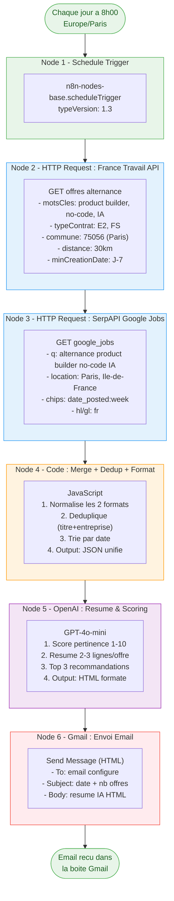
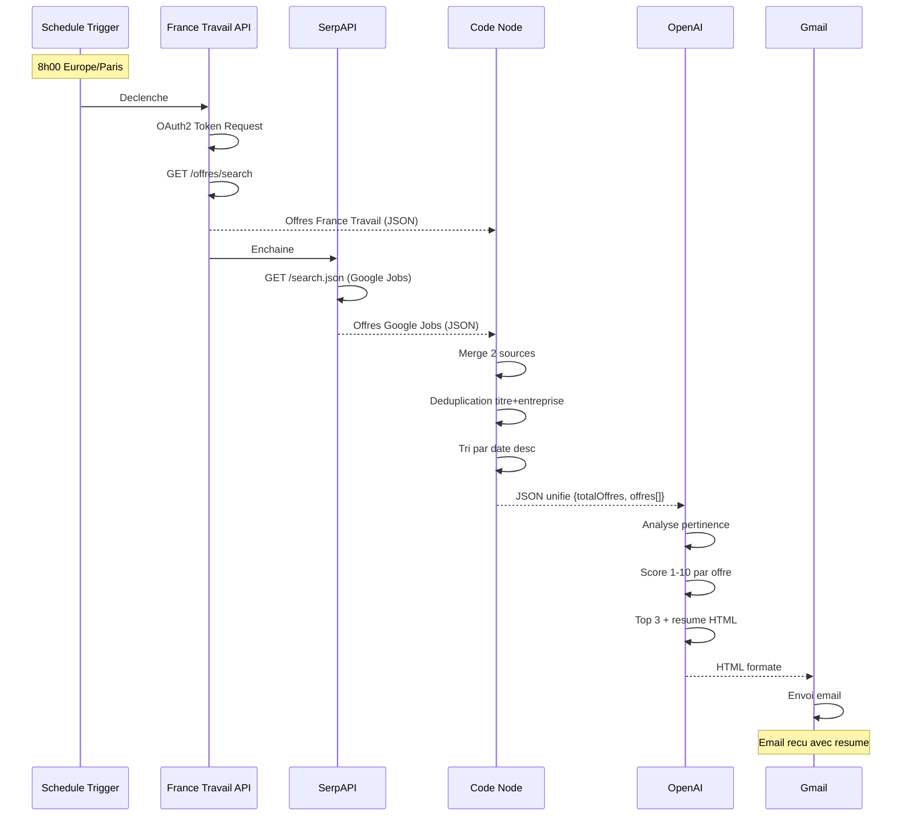

# Documentation Workflow - Veille Alternance n8n

## Vue d'ensemble

Workflow n8n automatise qui collecte, analyse et envoie chaque matin un resume des offres d'alternance "Product Builder No-Code & IA Generative" autour de Paris.

**6 nodes | Execution quotidienne 8h00 | ~2 min d'execution**

---

## Diagramme du Workflow



---

## Diagramme de sequence



---

## Structure des donnees

### Sortie du Code Node (input pour OpenAI)

```json
{
  "totalOffres": 12,
  "dateRecherche": "2026-02-01",
  "offres": [
    {
      "source": "France Travail",
      "titre": "Product Builder No-Code - Alternance",
      "entreprise": "StartupIA",
      "lieu": "Paris 9e",
      "datePublication": "2026-01-28",
      "typeContrat": "E2",
      "description": "Nous recherchons un product builder...",
      "url": "https://candidat.francetravail.fr/offres/...",
      "salaire": "1200 EUR/mois"
    },
    {
      "source": "Google Jobs (via Welcome to the Jungle)",
      "titre": "Alternant Product Builder IA",
      "entreprise": "TechCorp",
      "lieu": "Levallois-Perret",
      "datePublication": "Il y a 3 jours",
      "typeContrat": "Alternance",
      "description": "Rejoignez notre equipe produit...",
      "url": "https://www.welcometothejungle.com/...",
      "salaire": "Non precise"
    }
  ]
}
```

---

## Credentials requis

| # | Credential | Type dans n8n | Configuration |
|---|-----------|---------------|---------------|
| 1 | France Travail API | OAuth2 API | Client ID + Secret + Token URL + Scope |
| 2 | SerpAPI | Aucun (API Key en URL) | Cle en variable d'environnement |
| 3 | OpenAI | OpenAI API | API Key depuis platform.openai.com |
| 4 | Gmail | Gmail OAuth2 | Compte Google + App OAuth2 |

---

## Variables d'environnement

```
FRANCE_TRAVAIL_CLIENT_ID=xxxxx
FRANCE_TRAVAIL_CLIENT_SECRET=xxxxx
SERPAPI_KEY=xxxxx
EMAIL_DESTINATAIRE=vous@gmail.com
```

---

## Checklist de mise en production

- [ ] Toutes les variables d'environnement configurees
- [ ] 4 credentials crees et testes dans n8n
- [ ] Workflow execute manuellement avec succes
- [ ] Email recu et lisible
- [ ] `continueOnFail` active sur les 2 nodes HTTP Request
- [ ] Workflow active (toggle ON)
- [ ] Premiere execution automatique verifiee le lendemain
