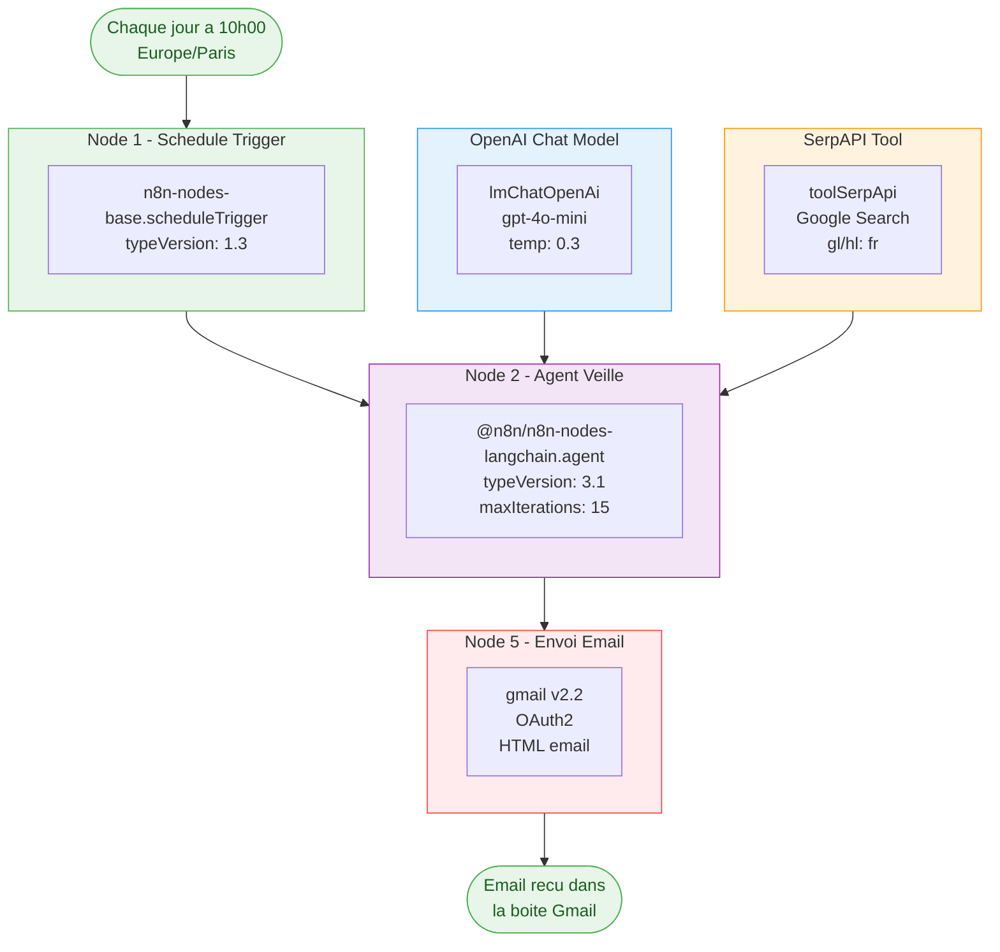
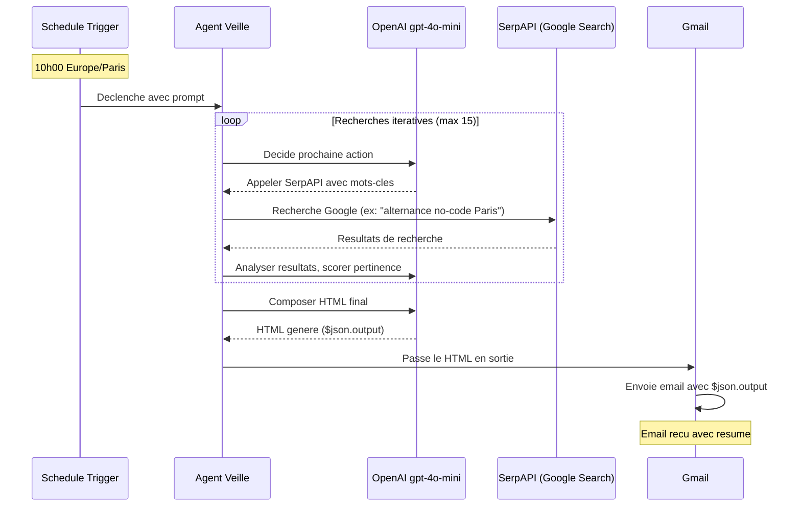

# Documentation Workflow - Veille Alternance n8n

## Vue d'ensemble

Workflow n8n automatise qui recherche, analyse et envoie chaque matin un resume des offres d'alternance "Product Builder No-Code & IA Generative" autour de Paris, via un **Agent IA autonome**.

**5 nodes (1 trigger + 1 agent + 2 sous-nodes + 1 Gmail) | Execution quotidienne 10h00 Europe/Paris | Workflow actif**

- **Workflow ID** : `6G7Ceg2OUZZ7ng5n`
- **Workflow Name** : `Veille Alternance - Agent IA`
- **Version** : 2.0

---

## Diagramme du Workflow



---

## Diagramme de sequence



---

## Detail des nodes

### Node 1 : Declencheur 10h00

| Propriete | Valeur |
|-----------|--------|
| ID | `node-1-trigger` |
| Type | `n8n-nodes-base.scheduleTrigger` |
| typeVersion | `1.3` |
| Declenchement | Chaque jour a 10h00 |
| Timezone | Europe/Paris (settings workflow) |

### Node 2 : Agent Veille

| Propriete | Valeur |
|-----------|--------|
| ID | `node-agent` |
| Type | `@n8n/n8n-nodes-langchain.agent` |
| typeVersion | `3.1` |
| promptType | `define` |
| maxIterations | `15` |

**System Message** :
```
Tu es un assistant specialise en veille d'offres d'alternance. Tu recherches des offres pour un candidat en Product Building no-code et IA generative cherchant une alternance a Paris / nord-ouest parisien. Tu utilises l'outil de recherche Google pour trouver des offres recentes. Ta reponse finale doit etre du HTML propre et professionnel avec un scoring de pertinence. Ne tente PAS d'envoyer d'email, contente-toi de produire le HTML.
```

**User Prompt** :
```
Aujourd'hui nous sommes le {{ $now.toFormat('dd/MM/yyyy') }}.
Recherche des offres d'alternance recentes (moins de 7 jours) pour un profil "Product Builder No-Code & IA Generative" a Paris et nord-ouest parisien (92, 95).
Fais plusieurs recherches avec des mots-cles varies : "alternance no-code Paris", "alternance IA generative Paris", "alternance product builder Paris", "apprentissage intelligence artificielle Paris".
Pour chaque offre trouvee, evalue sa pertinence (score 1-10) par rapport au profil.
Compose ta reponse finale en HTML avec : TOP 3 recommandations, puis tableau de toutes les offres (Score, Titre, Entreprise, Lieu, Resume, Lien).
Si aucune offre pertinente n'est trouvee, genere quand meme un HTML le mentionnant.
```

### Node 3 : OpenAI Chat Model (LLM)

| Propriete | Valeur |
|-----------|--------|
| ID | `node-openai` |
| Type | `@n8n/n8n-nodes-langchain.lmChatOpenAi` |
| typeVersion | `1.2` |
| Modele | `gpt-4o-mini` |
| Max Tokens | `4096` |
| Temperature | `0.3` |
| Credential | OpenAI API |

### Node 4 : SerpAPI Tool

| Propriete | Valeur |
|-----------|--------|
| ID | `node-serpapi-tool` |
| Type | `@n8n/n8n-nodes-langchain.toolSerpApi` |
| typeVersion | `1` |
| gl | `fr` |
| hl | `fr` |
| google_domain | `google.fr` |
| Credential | SerpAPI |

### Node 5 : Envoi Email (Gmail)

| Propriete | Valeur |
|-----------|--------|
| ID | `node-gmail` |
| Type | `n8n-nodes-base.gmail` |
| typeVersion | `2.2` |
| To | `palevasseur75@gmail.com` |
| Subject | `Veille Alternance - {{ $now.toFormat('dd/MM/yyyy') }}` |
| Body | `{{ $json.output }}` |
| appendAttribution | `false` |
| Credential | `Mam OAuth` (Gmail OAuth2) |

---

## Connections

| Source | Type | Destination |
|--------|------|-------------|
| Declencheur 10h00 | `main` | Agent Veille |
| OpenAI Chat Model | `ai_languageModel` | Agent Veille |
| SerpAPI Tool | `ai_tool` | Agent Veille |
| Agent Veille | `main` | Envoi Email |

---

## Credentials

| # | Credential | Type dans n8n | Nom |
|---|-----------|---------------|-----|
| 1 | OpenAI | OpenAI API | `OpenAi account` |
| 2 | SerpAPI | SerpApi API | `SerpAPI account` |
| 3 | Gmail | Gmail OAuth2 | `Mam OAuth` |

---

## Differences avec la v1.x (ancien workflow)

| Aspect | v1.x (ancien) | v2.0 (actuel) |
|--------|---------------|---------------|
| Architecture | 4 nodes lineaires | Agent IA + sous-nodes + Gmail |
| Recherche | 1 requete SerpAPI statique (Google Jobs) | Agent fait plusieurs recherches Google adaptatives |
| LLM | OpenAI gpt-4o-mini (node direct) | OpenAI gpt-4o-mini (via Agent langchain) |
| Email | Node Gmail recoit sortie OpenAI | Node Gmail recoit sortie Agent (`$json.output`) |
| Flexibilite | Requete figee | Agent autonome, mots-cles varies |
