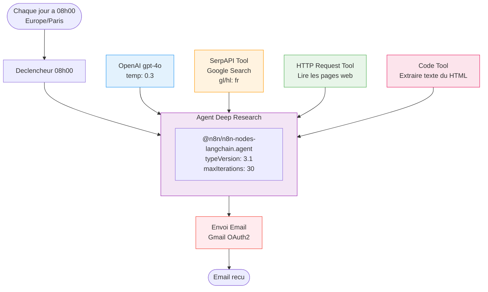
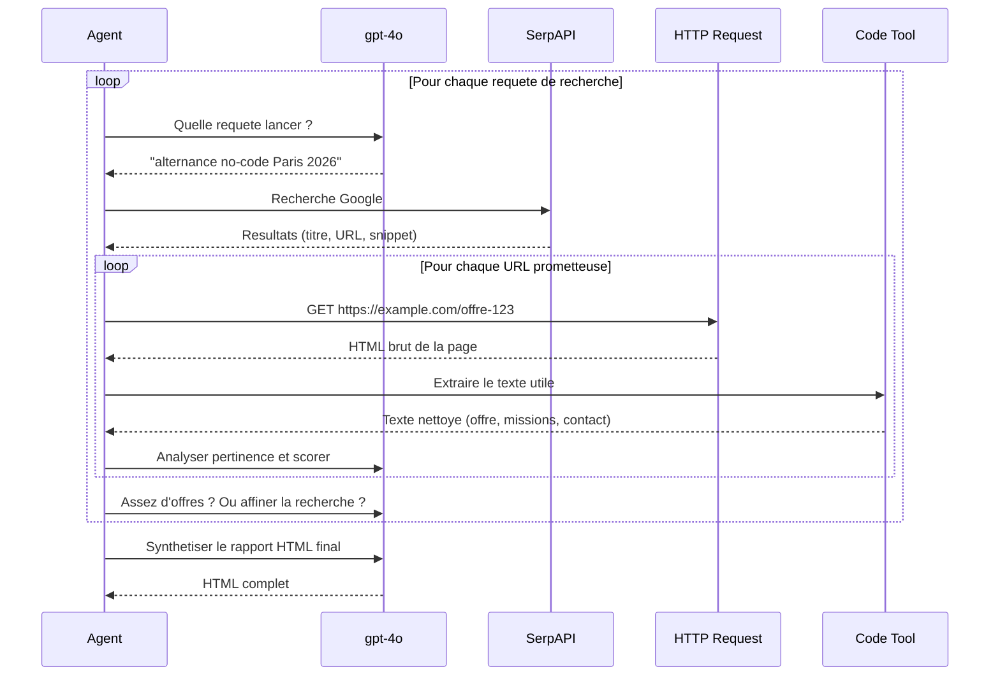

# Architecture Deep Research - Veille Alternance n8n

## Objectif

Remplacer la structure actuelle (Agent + SerpAPI snippets) par une architecture "Deep Research" capable de :
1. Chercher sur Google via SerpAPI
2. **Lire le contenu complet** des pages web trouvees
3. Analyser en profondeur chaque offre
4. Reboucler avec des recherches affinees
5. Synthetiser un rapport HTML complet

---

## Architecture cible

```
Schedule Trigger (08h00)
    └── Agent Deep Research (maxIterations: 30)
         ├── LLM : OpenAI gpt-4o
         ├── Tool 1 : SerpAPI (recherche Google)
         ├── Tool 2 : HTTP Request Tool (lire les pages web)
         └── Tool 3 : Code Tool (extraire le texte utile du HTML)

Agent Deep Research → Envoi Email (Gmail)
```



---

## Workflow de l'agent (boucle iterative)



---

## Nodes n8n

### Node 1 : Declencheur 08h00

| Propriete | Valeur |
|-----------|--------|
| Type | `n8n-nodes-base.scheduleTrigger` |
| typeVersion | `1.3` |
| Declenchement | Chaque jour a 08h00 |
| Timezone | Europe/Paris |

### Node 2 : Agent Deep Research

| Propriete | Valeur |
|-----------|--------|
| Type | `@n8n/n8n-nodes-langchain.agent` |
| typeVersion | `3.1` |
| promptType | `define` |
| maxIterations | `30` |

### Node 3 : OpenAI gpt-4o (LLM)

| Propriete | Valeur |
|-----------|--------|
| Type | `@n8n/n8n-nodes-langchain.lmChatOpenAi` |
| typeVersion | `1.2` |
| Modele | `gpt-4o` |
| Max Tokens | `4096` |
| Temperature | `0.3` |
| Credential | OpenAI API |

### Node 4 : SerpAPI Tool

| Propriete | Valeur |
|-----------|--------|
| Type | `@n8n/n8n-nodes-langchain.toolSerpApi` |
| typeVersion | `1` |
| gl | `fr` |
| hl | `fr` |
| google_domain | `google.fr` |
| toolDescription | Rechercher des offres d'emploi et d'alternance sur Google |
| Credential | SerpAPI |

### Node 5 : HTTP Request Tool

| Propriete | Valeur |
|-----------|--------|
| Type | `n8n-nodes-base.httpRequestTool` |
| typeVersion | `1.1` |
| toolDescription | Telecharger le contenu d'une page web a partir de son URL. Utilise cet outil pour lire le detail complet d'une offre d'emploi trouvee via Google. |
| method | `GET` |

> **Note** : certains sites (LinkedIn, Indeed) bloquent le scraping (erreur 403). L'agent doit gerer ces erreurs et passer au resultat suivant.

### Node 6 : Code Tool

| Propriete | Valeur |
|-----------|--------|
| Type | `@n8n/n8n-nodes-langchain.toolCode` |
| typeVersion | `1` |
| toolDescription | Extraire le texte utile d'une page HTML brute. Supprime les balises script, style, nav, footer et ne garde que le contenu principal. |

**Code JavaScript du tool** :

```javascript
// Input: query (le HTML brut de la page)
const html = query;

// Supprimer scripts, styles, nav, footer, header
let text = html
  .replace(/<script[\s\S]*?<\/script>/gi, '')
  .replace(/<style[\s\S]*?<\/style>/gi, '')
  .replace(/<nav[\s\S]*?<\/nav>/gi, '')
  .replace(/<footer[\s\S]*?<\/footer>/gi, '')
  .replace(/<header[\s\S]*?<\/header>/gi, '')
  .replace(/<[^>]+>/g, ' ')           // Supprimer toutes les balises
  .replace(/&nbsp;/g, ' ')
  .replace(/&amp;/g, '&')
  .replace(/&lt;/g, '<')
  .replace(/&gt;/g, '>')
  .replace(/\s+/g, ' ')               // Normaliser les espaces
  .trim();

// Limiter a 3000 caracteres pour ne pas exploser le contexte LLM
if (text.length > 3000) {
  text = text.substring(0, 3000) + '... [tronque]';
}

return text;
```

### Node 7 : Envoi Email (Gmail)

| Propriete | Valeur |
|-----------|--------|
| Type | `n8n-nodes-base.gmail` |
| typeVersion | `2.2` |
| To | `palevasseur75@gmail.com` |
| Subject | `Veille Alternance - {{ $now.toFormat('dd/MM/yyyy') }}` |
| Body | `{{ $json.output }}` |
| emailType | `html` |
| appendAttribution | `false` |
| Credential | `Mam OAuth` (Gmail OAuth2) |

---

## Connections

| Source | Type | Destination |
|--------|------|-------------|
| Declencheur 08h00 | `main` | Agent Deep Research |
| OpenAI gpt-4o | `ai_languageModel` | Agent Deep Research |
| SerpAPI Tool | `ai_tool` | Agent Deep Research |
| HTTP Request Tool | `ai_tool` | Agent Deep Research |
| Code Tool | `ai_tool` | Agent Deep Research |
| Agent Deep Research | `main` | Envoi Email |

---

## Comparaison : structure actuelle vs. Deep Research

| Aspect | Actuel (v2.0) | Deep Research (v3.0) |
|--------|---------------|----------------------|
| LLM | gpt-4o-mini | **gpt-4o** (meilleur raisonnement) |
| Recherche | SerpAPI seul (snippets 2 lignes) | SerpAPI + **lecture des pages completes** |
| Profondeur | Snippets superficiels | **Contenu complet** des offres |
| Extraction | Aucune | **Code Tool** nettoie le HTML |
| Iterations | 15 | **30** |
| Cout / execution | ~$0.01 | **~$0.15-0.30** |
| Qualite des resultats | Faible (offres generiques) | **Elevee** (analyse en profondeur) |

---

## Estimation des couts

| Ressource | Consommation / jour | Cout mensuel |
|-----------|---------------------|-------------|
| SerpAPI | ~6-10 recherches | $0 (gratuit) a $50 (plan payant si > 100/mois) |
| OpenAI gpt-4o | ~30 appels LLM, ~50K tokens | ~$5-10/mois |
| **Total** | | **~$5-60/mois** selon usage SerpAPI |

---

## Risques et mitigations

| Risque | Mitigation |
|--------|-----------|
| Sites bloquant le scraping (403) | Le prompt instruit l'agent de gerer les erreurs et passer au site suivant |
| Pages trop longues explosent le contexte | Code Tool tronque a 3000 caracteres |
| SerpAPI quota depasse (100/mois gratuit) | Surveiller le dashboard, passer au plan payant si necessaire |
| Cout gpt-4o eleve | maxTokens a 4096, temperature basse, iterations limitees a 30 |
| Execution trop longue (timeout) | maxIterations: 30 comme garde-fou, timeout workflow n8n |

---

## Credentials necessaires

| Credential | Statut | Action |
|-----------|--------|--------|
| OpenAI API | Existant | Changer le modele de gpt-4o-mini a gpt-4o |
| SerpAPI | Existant | Aucune modification |
| Gmail OAuth2 (Mam OAuth) | Existant | Aucune modification |

---

## Checklist d'implementation

- [ ] Creer le node HTTP Request Tool et le connecter a l'agent
- [ ] Creer le node Code Tool avec le script d'extraction HTML
- [ ] Changer le LLM de gpt-4o-mini a gpt-4o
- [ ] Augmenter maxIterations de 15 a 30
- [ ] Mettre a jour le system message et le prompt de l'agent
- [ ] Tester manuellement et verifier la qualite des resultats
- [ ] Verifier la consommation SerpAPI apres quelques jours
- [ ] Mettre a jour WORKFLOW-DOC.md et CLAUDE.md
- [ ] Commit git
